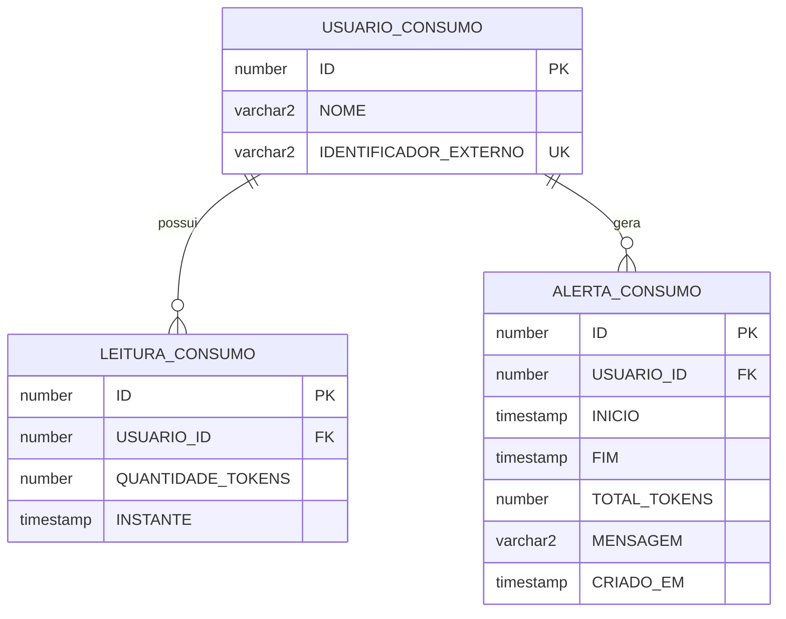

# Modelo Oracle do consumo da IA

Série simulada de tokens no Oracle local do admin. O Postgres do Supabase continua com o chat, os conteúdos e o dashboard que só conta perguntas. Esta camada acrescenta o total no período, o texto de status, o alerta gravado e o resumo por usuário.

Limite de consumo alto: **10.000 tokens no período**. Igual ou acima é alto. Abaixo é normal. A procedure de alerta aceita outro limite no parâmetro; quando ele vem nulo, usa 10.000.

Não há senha, URL nem usuário de banco neste documento.

## DER



`RELATORIO_CONSUMO_TMP` não entra no DER de negócio. É tabela temporária de sessão, apagada no início de cada relatório.

## Tabelas

### USUARIO_CONSUMO

Pessoa simulada do Conecta Geração. O identificador externo é fictício (`sim-abaixo-limite`, `sim-no-limite`, `sim-sem-leitura`).

| Coluna | Tipo | Regra |
|--------|------|-------|
| ID | NUMBER identity | Chave primária. É o parâmetro das functions e procedures. |
| NOME | VARCHAR2(120 CHAR) | Obrigatório. Preserva acento. |
| IDENTIFICADOR_EXTERNO | VARCHAR2(64 CHAR) | Obrigatório e único. Não é uid do Supabase. |

### LEITURA_CONSUMO

Ponto da série: quantidade de tokens em um instante. Várias leituras por usuário.

| Coluna | Tipo | Regra |
|--------|------|-------|
| ID | NUMBER identity | Chave primária. |
| USUARIO_ID | NUMBER | FK para USUARIO_CONSUMO, sem cascade. |
| QUANTIDADE_TOKENS | NUMBER(12) | Obrigatório, maior ou igual a zero. |
| INSTANTE | TIMESTAMP | Entra na soma quando está dentro do período fechado. |

Índice `(USUARIO_ID, INSTANTE)`.

### ALERTA_CONSUMO

Registro de consumo alto. No máximo uma linha por usuário e período.

| Coluna | Tipo | Regra |
|--------|------|-------|
| ID | NUMBER identity | Chave primária. |
| USUARIO_ID | NUMBER | FK para USUARIO_CONSUMO, sem cascade. |
| INICIO | TIMESTAMP | Início do período fechado. |
| FIM | TIMESTAMP | Fim do período. Check `INICIO <= FIM`. |
| TOTAL_TOKENS | NUMBER(12) | Total que justificou o alerta. Maior ou igual a zero. |
| MENSAGEM | VARCHAR2(400 CHAR) | Frase com nome, total e `Consumo alto.` |
| CRIADO_EM | TIMESTAMP | Preenchido com `SYSTIMESTAMP`. |

Único `(USUARIO_ID, INICIO, FIM)`.

## Período de demonstração

`2026-09-01 00:00:00` até `2026-09-30 23:59:59`.

| Usuário | Total no período | Status com limite 10.000 |
|---------|------------------|---------------------------|
| Ana Clara | 3500 | normal |
| Bruno Alves | 10000 | alto |
| Clara Sem Leituras | 0 | normal |

## Functions

### FN_INDICADOR_TOKENS

Soma `QUANTIDADE_TOKENS` do usuário no período fechado.

| | |
|--|--|
| Parâmetros | `p_usuario_id NUMBER`, `p_inicio TIMESTAMP`, `p_fim TIMESTAMP` |
| Retorno | `NUMBER` |
| Zero | Só quando o usuário existe e não há leitura no período |
| Erros | `-20001` usuário inexistente. `-20002` período inválido |

### FN_CONSUMO_FORMATADO

Uma frase em português. Reutiliza o indicador. O limite interno é 10.000.

| | |
|--|--|
| Parâmetros | os mesmos três |
| Retorno | `VARCHAR2` |
| Alto | `{nome} consumiu {total} tokens no período. Consumo alto.` |
| Normal | `{nome} consumiu {total} tokens no período. Consumo normal.` |

`{total}` sai sem separador de milhar. Usuário inexistente e período inválido não viram frase de consumo zero.

## Procedures

### PR_REGISTRAR_ALERTA_CONSUMO

Avalia o usuário e grava o alerta se o total atinge o limite. Usa IF. Não duplica.

| | |
|--|--|
| IN | `p_usuario_id`, `p_inicio`, `p_fim`, `p_limite` (nulo vira 10.000) |
| OUT | `p_alerta_id` — id do alerta único, ou nulo se o total ficou abaixo do limite |
| Grava | usuário, período, total e mensagem |
| Erros | `-20001`, `-20002`, `-20003` se o limite é negativo |

Rodar de novo para o mesmo usuário e período devolve o mesmo alerta. Esta é a procedure que o Java dispara.

### PR_RELATORIO_CONSUMO

Percorre os usuários com cursor e loop. Para cada um, soma com a function e marca com IF se já existe alerta naquele período.

| | |
|--|--|
| IN | `p_inicio`, `p_fim` |
| OUT | `p_resultado SYS_REFCURSOR` |
| Colunas | `USUARIO_ID`, `NOME`, `TOTAL_TOKENS`, `TEM_ALERTA` (1 ou 0) |
| Erros | `-20002` antes do loop. Qualquer outra falha esvazia o rascunho e não publica cursor parcial |

Usuário sem leitura no período sai com total 0 e sem alerta.

## Fluxo até o Java

```text
Angular (operador logado)
  -> REST com Bearer JWT
  -> admin-api Spring
  -> JDBC (pool Oracle separado do Postgres)
  -> FN_INDICADOR_TOKENS, FN_CONSUMO_FORMATADO
  -> PR_RELATORIO_CONSUMO
  -> PR_REGISTRAR_ALERTA_CONSUMO no disparo
```

| Chamada | Rota | Efeito |
|---------|------|--------|
| Consulta | `GET /api/consumption` | Indicador, texto, alertas do usuário e relatório |
| Disparo | `POST /api/consumption/alerts` | `CallableStatement` em `PR_REGISTRAR_ALERTA_CONSUMO` |

Sem JWT a API recusa e o Oracle não é chamado. Período invertido responde 400 sem chamar a procedure.

Credenciais só no ambiente: `ORACLE_URL`, `ORACLE_USERNAME`, `ORACLE_PASSWORD`. Se faltarem, ou se a instância estiver fora, a rota de consumo responde erro. O dashboard que conta perguntas no Postgres continua no datasource original.

O que esta camada acrescenta ao dashboard atual: o dashboard conta mensagens no Supabase. Aqui o operador vê a série simulada de tokens, o status alto ou normal a partir de 10.000, o alerta gravado no Oracle e uma linha de resumo por usuário.
