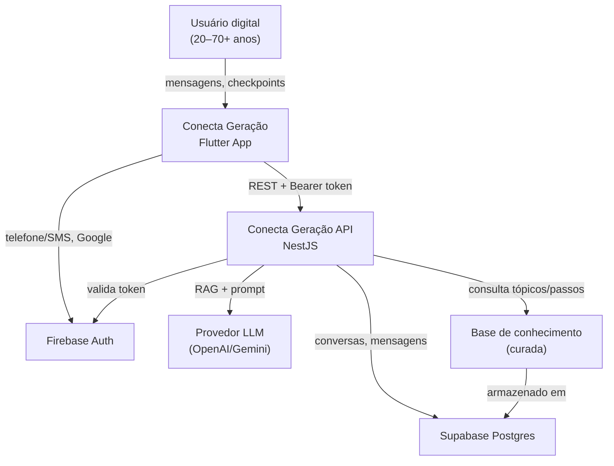

# Orientação digital guiada — System Context

## System Overview

App mobile **Flutter** + API **NestJS** que oferece um **assistente conversacional com IA** para analfabetos digitais. A IA consulta uma **base de conhecimento** curada (6 tópicos MVP), faz **checkpoints** para saber em que etapa o usuário está e orienta passo a passo — sem pedir senhas ou tokens **no chat**. Autenticação via **Firebase Auth** (caminho principal: **telefone + SMS OTP**; alternativo: Google e, futuramente, e-mail/senha); conversas persistidas no **Postgres/Supabase** por `firebase_uid`.

## Context Diagram

## Actors

- **Usuário digital** (Human): Analfabeto digital, smartphone próprio, usa o app sozinho; idade 20–70+.
- **Visitante convidado** (Human): Experimenta o app sem conta; IA disponível, histórico **não** persistido entre visitas.
- **Equipe de conteúdo** (Human, interno): Curadoria dos 6 tópicos e checkpoints na base de conhecimento (MVP: seed estático/JSON).
- **API NestJS** (System): Orquestra chat, RAG, guardrails e persistência.
- **Provedor LLM** (External System): Gera respostas conversacionais a partir do contexto RAG.

## External Integrations

| Sistema | Direção | Dados | Protocolo | Risco |
|---------|---------|-------|-----------|-------|
| Firebase Auth | App ↔ API | ID token, `firebase_uid`, `displayName`, phone provider | SDK / Admin SDK | Médio (custo SMS) |
| Provedor LLM | API → externo | Prompt + contexto RAG (sem PII sensível) | HTTPS REST | Alto |
| Supabase Postgres | API ↔ DB | Conversas, mensagens, tópicos, passos | Prisma/SQL | Médio |
| Render | Deploy API | — | HTTPS | Baixo |

## Data Flows

### Inbound (para o sistema)

| Origem | Dados | Validação |
|--------|-------|-----------|
| App mobile | Mensagem do usuário, resposta de checkpoint (sim/não/texto) | Auth Firebase; sanitização; rate limit |
| App mobile | Preferências de acessibilidade | Auth; enum validado |
| Admin/seed | Tópicos e passos da base | Schema validado; revisão humana |

### Outbound (do sistema)

| Destino | Dados | Garantia |
|---------|-------|----------|
| App mobile | Resposta da IA (texto simples, 1 passo por vez) | Entrega síncrona; fallback em erro LLM |
| App mobile | Lista/histórico de conversas | Paginação; cache local opcional |
| Provedor LLM | Prompt + chunks RAG | Sem senhas/tokens; minimização LGPD |
| Postgres | Conversas, mensagens, metadados de checkpoint | Persistência transacional |

## High-Level Constraints

- LGPD: minimização de dados; sem armazenar credenciais digitadas no chat
- Gov.br: **somente conteúdo educativo** — sem OAuth/integração de login
- MVP em ~3 meses; escala de testes ~100 sessões simultâneas
- Offline: leitura de conversas cacheadas; chat ao vivo exige rede
- Linguagem e UX conforme `memory-bank/standards/ux-guide.md`

## Key NFR Goals

- Latência IA p95 < 8s (MVP)
- Guardrails: IA nunca solicita senha, token, OTP ou PIN no chat (OTP só na tela de login)
- WCAG 2.1 AA no chat e navegação
- Respostas derivadas da base de conhecimento (RAG), não alucinação livre
