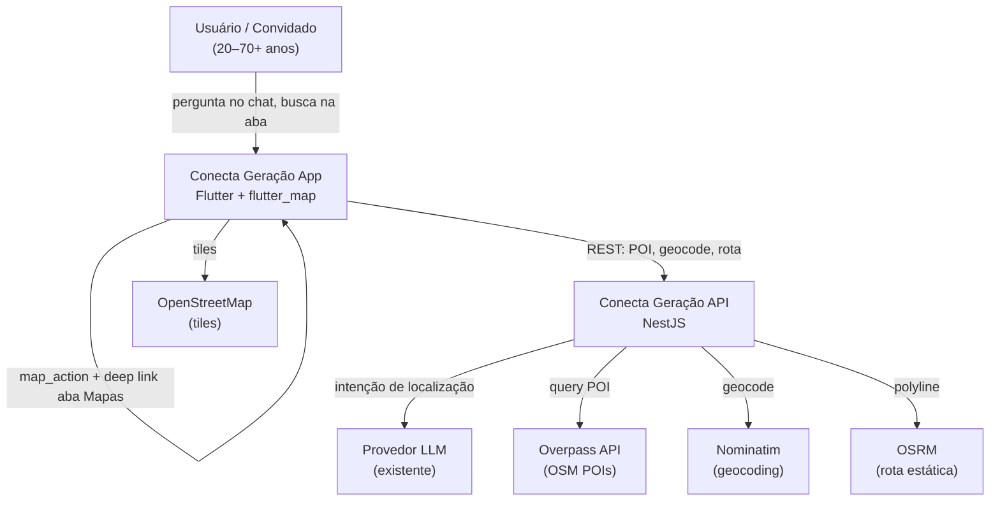

# Mapas e lugares próximos — System Context

## System Overview

Extensão do **Conecta Geração** (Flutter + NestJS) com **aba Mapas in-app** usando stack **OpenStreetMap gratuita**: `flutter_map` (tiles OSM), **Overpass API** (POIs), **Nominatim** (geocodificação cidade/bairro), **OSRM** (rota estática). O **assistente IA** detecta perguntas sobre lugares próximos no chat e redireciona para o mapa com rota. Usuários **autenticados e convidados** podem buscar diretamente na aba Mapas.

## Context Diagram

## Actors

- **Usuário digital** (Human): Busca lugares via chat ou aba Mapas; pode negar GPS e informar cidade/bairro.
- **Visitante convidado** (Human): Mesmo acesso à aba Mapas e fluxo de busca; sem persistência de histórico de trajetos.
- **Assistente IA** (System): Detecta intenção geográfica, sugere raio (2/5/10 km), confirma categoria.
- **API NestJS — Maps Module** (System): Proxy/cache para Overpass, Nominatim e OSRM; expõe endpoints REST ao app.
- **Serviços OSM** (External): Overpass, Nominatim, OSRM, tiles OSM — todos gratuitos com rate limits.

## External Integrations

| Sistema | Direção | Dados | Protocolo | Risco |
|---------|---------|-------|-----------|-------|
| Overpass API | API → externo | Query OSM por categoria + raio | HTTPS | Médio (rate limit, cobertura OSM) |
| Nominatim | API → externo | Cidade/bairro → lat/lon | HTTPS | Médio (rate limit 1 req/s) |
| OSRM | API → externo | Origem/destino → polyline + distância | HTTPS | Médio (instância pública instável) |
| OpenStreetMap tiles | App → externo | Tiles de mapa | HTTPS | Baixo |
| Provedor LLM (existente) | API → externo | Detecção de intenção + sugestão de raio | HTTPS | Baixo (extensão de fluxo existente) |
| Firebase Auth (existente) | App ↔ API | Token para endpoints autenticados | SDK/REST | Baixo |
| `001-digital-guidance` chat | App ↔ API | Mensagens + `map_action` estruturado | REST | Baixo |

## Data Flows

### Inbound

| Origem | Dados | Validação |
|--------|-------|-----------|
| App mobile | Coordenadas GPS (lat/lon) ou cidade/bairro | Permissão local; sanitização texto |
| App mobile | Categoria POI (6 tipos), raio (2/5/10 km) | Enum validado; default 5 km |
| Chat | Mensagem natural do usuário | Auth/guest; guardrails existentes |
| App mobile | Seleção de POI para rota | ID OSM ou coordenadas |

### Outbound

| Destino | Dados | Garantia |
|---------|-------|----------|
| App mobile | Lista POIs (nome, endereço, distância) | Ordenado por distância |
| App mobile | Polyline rota estática + distância/tempo | Fallback mensagem se OSRM falhar |
| App mobile | `map_action` no chat (categoria, raio, POI) | JSON estruturado para navegação |
| Overpass/Nominatim/OSRM | Queries proxy | User-Agent; cache curto na API |

## High-Level Constraints

- Stack **100% gratuita** no MVP (sem Google Maps/Places pagos)
- Atribuição **OpenStreetMap** obrigatória na UI
- LGPD: localização usada só na sessão; sem histórico de trajetos persistido
- Linguagem simples conforme `ux-guide.md`
- Proxy NestJS recomendado para respeitar rate limits de Nominatim/Overpass

## Key NFR Goals

- Mapa visível p95 < 3s após permissão
- Busca POI p95 < 4s; geocoding p95 < 3s
- Degradação graciosa quando APIs OSM indisponíveis
- WCAG 2.1 AA na aba Mapas
