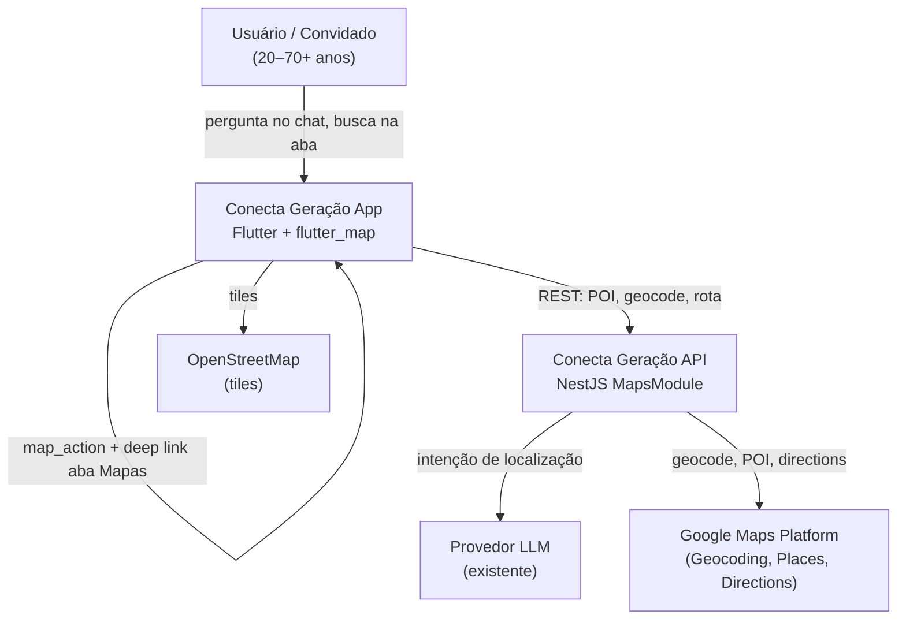

# Mapas e lugares próximos — System Context

## System Overview

Extensão do **Conecta Geração** (Flutter + NestJS) com **aba Mapas in-app**. **Tiles**: `flutter_map` + OpenStreetMap (gratuito, atribuição na UI). **Backend proxy**: **Google Maps Platform** — Geocoding API (cidade/bairro/CEP), Places Nearby Search (POIs) e Directions API (rota estática). O **assistente IA** detecta perguntas sobre lugares próximos no chat e redireciona para o mapa com rota. Usuários **autenticados e convidados** podem buscar diretamente na aba Mapas.

## Context Diagram

## Actors

- **Usuário digital** (Human): Busca lugares via chat ou aba Mapas; pode negar GPS e informar cidade/bairro/CEP.
- **Visitante convidado** (Human): Mesmo acesso à aba Mapas e fluxo de busca; sem persistência de histórico de trajetos.
- **Assistente IA** (System): Detecta intenção geográfica, sugere raio (2/5/10 km), confirma categoria.
- **API NestJS — Maps Module** (System): Proxy para Google Maps Platform; expõe `/maps/search`, `/maps/geocode`, `/maps/route`.
- **Google Maps Platform** (External): Geocoding, Places Nearby Search, Directions — chave `GOOGLEMAPS_API_KEY` no backend.
- **OpenStreetMap tiles** (External): Renderização do mapa no Flutter — gratuito com atribuição.

## External Integrations

| Sistema | Direção | Dados | Protocolo | Risco |
|---------|---------|-------|-----------|-------|
| Google Geocoding API | API → externo | CEP/cidade/bairro → lat/lon | HTTPS | Médio (quota/billing) |
| Google Places Nearby Search | API → externo | POI por categoria + raio | HTTPS | Médio (quota/cobertura) |
| Google Directions API | API → externo | Origem/destino → polyline + distância | HTTPS | Médio (quota) |
| OpenStreetMap tiles | App → externo | Tiles de mapa | HTTPS | Baixo |
| Provedor LLM (existente) | API → externo | Detecção de intenção + sugestão de raio | HTTPS | Baixo |
| Firebase Auth (existente) | App ↔ API | Token para endpoints autenticados | SDK/REST | Baixo |

## Data Flows

### Inbound

| Origem | Dados | Validação |
|--------|-------|-----------|
| App mobile | Coordenadas GPS (lat/lon) ou cidade/bairro/CEP | Permissão local; sanitização texto |
| App mobile | Categoria POI (6 tipos), raio (2/5/10 km) | Enum validado; default 5 km |
| Chat | Mensagem natural do usuário | Auth/guest; guardrails existentes |
| App mobile | Seleção de POI para rota | `osmId` (place_id Google) ou coordenadas |

### Outbound

| Destino | Dados | Garantia |
|---------|-------|----------|
| App mobile | Lista POIs (nome, endereço, distância) | Ordenado por distância |
| App mobile | Polyline rota estática + distância/tempo | Fallback mensagem se Directions falhar |
| App mobile | `map_action` no chat (categoria, raio, POI) | JSON estruturado para navegação |
| Google Maps Platform | Queries proxy | Chave API no servidor; cache geocode |

## High-Level Constraints

- Tiles **OpenStreetMap** no Flutter (gratuito; atribuição obrigatória)
- Backend usa **Google Maps Platform** (ADR-011); chave nunca no app mobile
- LGPD: localização usada só na sessão; sem histórico de trajetos persistido
- Linguagem simples conforme `ux-guide.md`
- ThrottlerGuard global + cache geocode in-memory

## Key NFR Goals

- Mapa visível p95 < 3s após permissão
- Busca POI p95 < 4s; geocoding p95 < 3s
- Degradação graciosa quando Google Maps indisponível
- WCAG 2.1 AA na aba Mapas
