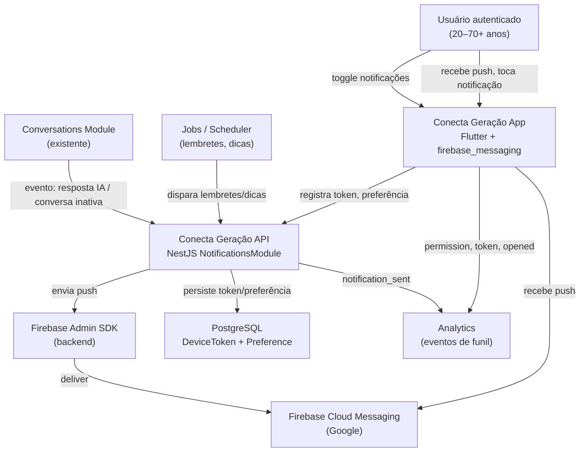

# Notificações push — System Context

## System Overview

Extensão do **Conecta Geração** (Flutter + NestJS) com **Firebase Cloud Messaging (FCM)** para reengajar usuários autenticados via push notifications. O **backend** orquestra todos os envios (lembretes de conversa, resposta da IA em background, dicas educativas e campanhas administrativas). O **app Flutter** integra `firebase_messaging`, solicita permissão contextualmente, sincroniza token FCM e trata deep links.

**Fora de escopo**: convidados (guest), painel admin, categorias configuráveis.

## Context Diagram

## Actors

- **Usuário autenticado** (Human): Recebe notificações, concede/nega permissão, configura toggle, abre deep links.
- **Operador interno** (Human): Dispara campanhas via API interna/backend (sem painel no MVP).
- **NotificationsModule** (System): NestJS — registro de token, preferências, envio FCM, jobs.
- **Scheduler / Jobs** (System): Detecta conversas abandonadas e agenda dicas educativas.
- **Conversations Module** (System): Emite eventos quando IA responde ou conversa fica inativa.
- **Firebase Cloud Messaging** (External): Entrega push para dispositivos iOS/Android.

## External Integrations

| Sistema | Direção | Dados | Protocolo | Risco |
|---------|---------|-------|-----------|-------|
| Firebase Cloud Messaging | API → FCM → App | Título, corpo genérico, deep link payload | FCM HTTP v1 (Admin SDK) | Médio (tokens inválidos, iOS APNs) |
| Firebase Admin SDK | API → Google | Service account credentials | HTTPS | Baixo (já usado para Auth) |
| Firebase Auth (existente) | App ↔ API | ID token para endpoints de registro | SDK/REST | Baixo |
| PostgreSQL (existente) | API ↔ DB | DeviceToken, NotificationPreference | Prisma | Baixo |
| Conversations (intent 001) | Interno | conversationId, lastActivity | NestJS DI / events | Médio (acoplamento controlado) |
| Analytics (Firebase ou logs) | App + API → destino | Eventos de funil | SDK / structured logs | Baixo |

## Data Flows

### Inbound

| Origem | Dados | Validação |
|--------|-------|-----------|
| App mobile | FCM device token | Auth obrigatório; formato token FCM |
| App mobile | Preferência enabled/disabled | Auth; boolean |
| Conversations | Evento resposta IA pronta | conversationId, firebaseUid |
| Scheduler | Conversa inativa > X horas | conversationId, firebaseUid |
| API interna | Campanha (título, corpo, segmento, deep link) | Auth interno/service role |

### Outbound

| Destino | Dados | Garantia |
|---------|-------|----------|
| FCM → App | notification: title, body, data{route, conversationId, type} | Payload mínimo; sem dados sensíveis |
| App (deep link) | Navegação interna | Cold start, background, foreground |
| Analytics | Eventos de funil | Sem PII no payload de analytics |
| PostgreSQL | Token ativo/inativo, preferência | Consistência no logout |

## High-Level Constraints

- Permissão **não** na primeira abertura — contextual após valor percebido
- Payload FCM **genérico** — sem conteúdo pessoal completo de conversa
- LGPD: opt-in explícito, toggle de oposição, token removido no logout
- Arquitetura preparada: `NotificationsModule`, `DeviceToken`, `NotificationPreference`, `PushNotificationProvider`
- **Prioridade**: implementar após auth, chat e maps estáveis

## Key NFR Goals

- Registro token p95 < 500ms
- Envio FCM p95 < 5s após trigger
- Deep link warm start < 2s
- Entrega FCM > 95% para tokens válidos
