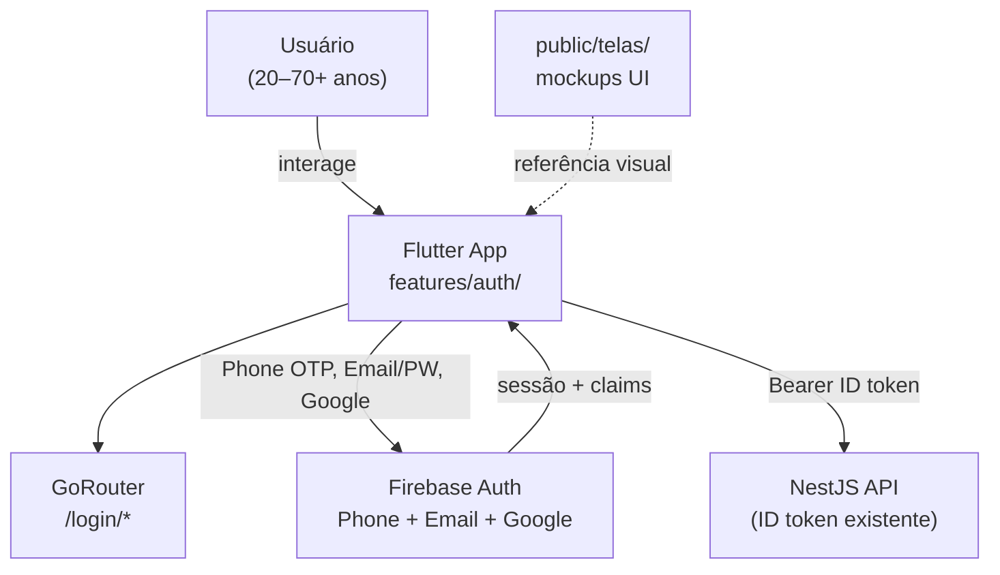

# Auth Login Experience — System Context

## System Overview

Evolução da **camada de apresentação de autenticação** no app Flutter e extensão do **Firebase Auth** com **Email/Password**. O backend NestJS **não muda** — continua validando Firebase ID tokens. Toda lógica nova fica em `apps/mobile/lib/features/auth/`.

**Referência de design**: `public/telas/` (capturas 2026-06-11).

## Context Diagram



## Actors

- **Usuário novo** (Human): Cadastra por telefone, e-mail ou Google; ou entra como convidado.
- **Usuário retornando** (Human): Login por e-mail/senha, telefone ou Google.
- **Firebase Auth** (External): Phone SMS OTP, Email/Password, Google OAuth, email verification link.
- **GoRouter** (System): Gate `/login` → home / onboarding / convidado.

## Fluxos de autenticação

```text
/login (welcome)
  ├─ Fazer cadastro → /login/phone
  │     ├─ Avançar → /login/otp → home/onboarding
  │     └─ Se cadastrar de outra forma → /login/email
  └─ Continua sem Cadastro → guest → /home

/login/email
  ├─ Avançar (cadastro) → /login/email-verify → onboarding/home
  ├─ Avançar (login) → home/onboarding
  ├─ Google → home/onboarding
  └─ Já tenho conta ↔ Criar conta (toggle)
```

## External Integrations

| Sistema | Direção | Dados | Protocolo | Risco |
|---------|---------|-------|-----------|-------|
| Firebase Phone Auth | App ↔ Firebase | E.164, SMS OTP 6 dígitos | SDK | Médio (custo SMS) |
| Firebase Email/Password | App ↔ Firebase | email, password hash | SDK | Baixo |
| Firebase Email Verification | App ↔ Firebase | verification link | SDK + e-mail | Médio (deliverability) |
| Google Sign-In | App ↔ Firebase | OAuth tokens | SDK | Baixo |
| NestJS API | App → API | Firebase ID token | HTTPS | Baixo (sem mudança) |

## Decisões de produto / técnica

| Tópico | Decisão |
|--------|---------|
| OTP telefone | **6 dígitos** (Firebase); UI em caixas separadas no estilo do mockup |
| OTP e-mail 4 dígitos no mockup | Firebase envia **link de verificação**; UI mantém layout do mockup com copy adaptada + "Reenviar e-mail" |
| Tela `/login/alternative` | Substituída por `/login/email` (Google integrado na tela e-mail) |
| Backend | Sem endpoints novos; auth permanece client-side Firebase |

## High-Level Constraints

- Reutilizar `AppColors`, `AppSpacing`, `BrandTheme`, assets em `assets/`
- Não quebrar bolts 010 e 021 (convidado efêmero, login gate)
- Copy em PT-BR simples para público idoso
- Portrait only (MVP)

## Key NFR Goals

- Fluxo telefone completo ≤ 2 min (inclui SMS)
- Cadastro e-mail + verificação ≤ 5 min
- Zero regressão no redirect autenticado → `/home`
