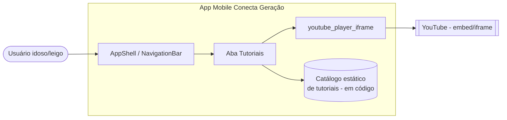

# Aba de Tutoriais - System Context

## System Overview

Feature de UI no app mobile Flutter (`apps/mobile`) que adiciona uma nova aba
"Tutoriais" à navegação principal (`StatefulShellRoute.indexedStack`), entre as
abas Chat e Configurações. A aba lista vídeos-tutoriais do YouTube reproduzidos
inline por meio da biblioteca `youtube_player_iframe`. No MVP, o catálogo é
estático (2 vídeos definidos em código), sem backend.

## Context Diagram

## External Integrations

- **YouTube (iframe/embed)**: fonte dos vídeos; o player carrega o conteúdo a
  partir do ID do vídeo extraído da URL. Requer conectividade de rede.

## High-Level Constraints

- Deve reutilizar o padrão de navegação existente (`StatefulShellRoute.indexedStack`)
  e a arquitetura por feature (`lib/features/<feature>/...`).
- Nova dependência `youtube_player_iframe` a ser adicionada ao `pubspec.yaml`.
- Catálogo estático em código para o MVP (sem CMS/API).
- Seguir tema, `AppSpacing` e diretrizes de acessibilidade do app.

## Key NFR Goals

- Abertura instantânea da aba (dados locais).
- Reprodução sem sair do app, sem travar a UI durante o carregamento.
- Acessibilidade: rótulos semânticos, área de toque mínima, respeito ao
  `textScaler`.
- Extensibilidade: adicionar novos tutoriais alterando apenas a lista de dados.
