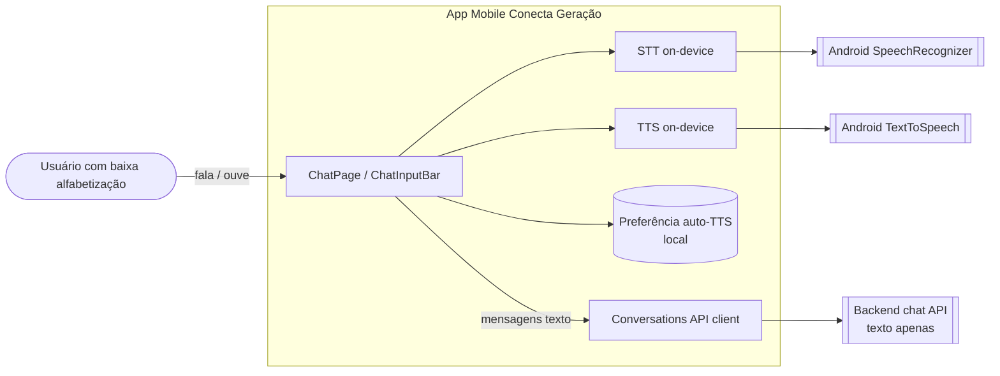

# Assistência por voz no chat - System Context

## System Overview

Enhancement de UI no app mobile Flutter (`apps/mobile`) que ativa o botão de
voz já presente na barra de input do chat (`ChatInputBar`) e adiciona leitura
em voz alta das respostas do assistente. No MVP, STT e TTS são **on-device** no
**Android**; o texto reconhecido segue o pipeline de chat existente (sem
endpoint de áudio no backend). Pós-028, o TTS inclui sanitização de texto,
guards de ciclo de vida e estados/controles refinados (bolts 029/030).

## Context Diagram

## Actors

- **Usuário final (humano)**: pessoa que usa o chat; pode depender de fala e
  escuta em vez de leitura/escrita.
- **Assistente IA (sistema interno via API)**: gera respostas em texto que o
  TTS lê em voz alta.

## External Integrations

| System | Direction | Data | Protocol / Notes |
|--------|-----------|------|------------------|
| Android SpeechRecognizer (via pacote STT) | Outbound local | Áudio → texto pt-BR | On-device; não sobe ao backend |
| Android TextToSpeech (via pacote TTS) | Outbound local | Texto → áudio | On-device |
| Backend chat API existente | Outbound | Mensagens texto | HTTP JSON (inalterado) |

## Data Flows

### Inbound
- Toques do usuário (iniciar/parar gravação, parar/repetir TTS, toggle auto-TTS).
- Permissão de microfone (sistema Android).
- Respostas de texto do assistente (já existentes no chat).

### Outbound
- Texto reconhecido → campo de input → envio via fluxo de chat atual.
- Nenhum arquivo de áudio sai do dispositivo neste intent.

## High-Level Constraints

- Reutilizar `lib/features/chat/...` (`ChatPage`, `ChatInputBar`).
- Android only no MVP; iOS não quebra a UI.
- Sem Web Speech API; sem cloud STT/TTS; sem áudio no backend.
- Seguir tema, `AppSpacing` e acessibilidade (TalkBack).

## Key NFR Goals

- Escuta e TTS iniciam em ~1–1,5 s com permissão já concedida.
- Degradação graciosa se STT/TTS/permissão falharem.
- Auto-TTS ligado por padrão; preferência persistida localmente.
