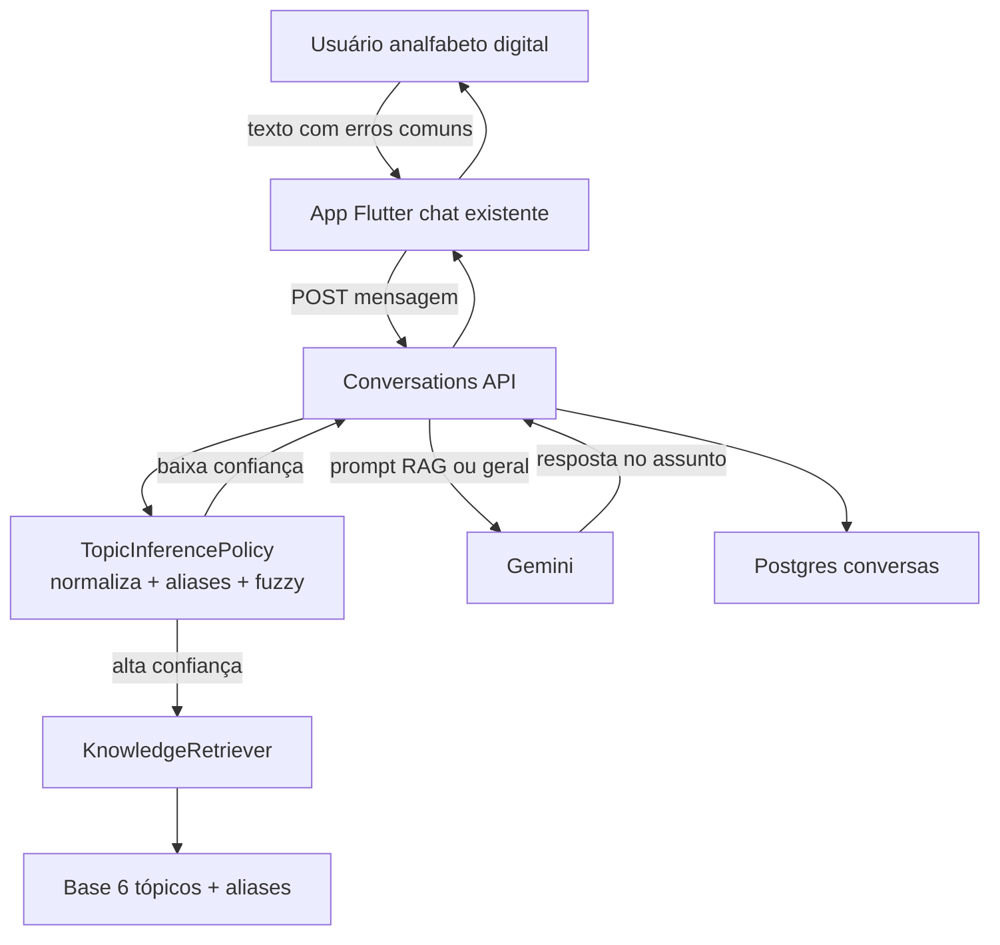

# Relevância do RAG — System Context

## System Overview

Correção no **backend NestJS** do assistente: a mensagem do usuário passa por
uma inferência de tópico **tolerante a erros de escrita**. Com confiança, o RAG
injeta **somente** os passos do tópico certo. Sem confiança, a IA pergunta de
novo. Fora dos 6 tópicos, responde com conhecimento geral do LLM (guardrails
iguais). Troca de assunto no meio da conversa é **imediata**.

O app Flutter **não muda de layout** — só recebe texto de resposta diferente.

## Context Diagram

## Actors

- **Usuário digital** (Human): analfabeto digital; escreve palavras complexas errado; espera resposta no assunto que perguntou.
- **API NestJS / módulo conversations** (System): classifica intenção, monta prompt, persiste `topicSlug`.
- **Módulo knowledge-base** (System interno): seed de tópicos, keywords e aliases.
- **Provedor LLM Gemini** (External): gera texto a partir do prompt (RAG ou modo geral).

## External Integrations

| Sistema | Direção | Dados | Protocolo | Risco |
|---------|---------|-------|-----------|-------|
| Gemini (já configurado) | API → externo | Prompt RAG **ou** prompt de orientação geral | HTTPS | Alto (alucinação no modo geral) |
| Postgres / Prisma | API ↔ DB | `topicSlug`, `currentStep`, mensagens | SQL | Baixo |
| Knowledge-base interna | In-process | Tópicos, steps, keywords, aliases | Porta Nest | Baixo |

Nenhuma integração nova. Sem embeddings / vector DB neste intent.

## Data Flows

### Inbound
- Mensagem de texto do chat (usuário autenticado ou convidado) — mesmo contrato HTTP atual.
- `topicSlug` e `currentStep` já persistidos na conversa (podem ser ignorados se a mensagem nova for outro assunto).

### Outbound
- Resposta da IA no assunto da pergunta, ou pergunta de esclarecimento, ou orientação geral.
- `topicSlug` atualizado só com confiança; `currentStep` zerado na troca de tópico.

## High-Level Constraints

- Reusar `TopicInferencePolicy`, `PrismaKnowledgeRetriever`, `RagPromptBuilder`, `GeminiAssistantReplyGenerator`.
- Não criar stack paralelo de RAG.
- Guardrails de senha/token valem nos dois modos de prompt.
- Sem tela nova; sem tópicos novos no catálogo.

## Key NFR Goals

- Inferência de tópico < 50ms p95 (sem LLM).
- Chat ponta a ponta sem regressão (< 8s p95).
- 0 injeção de passos do tópico errado nos casos de teste.
