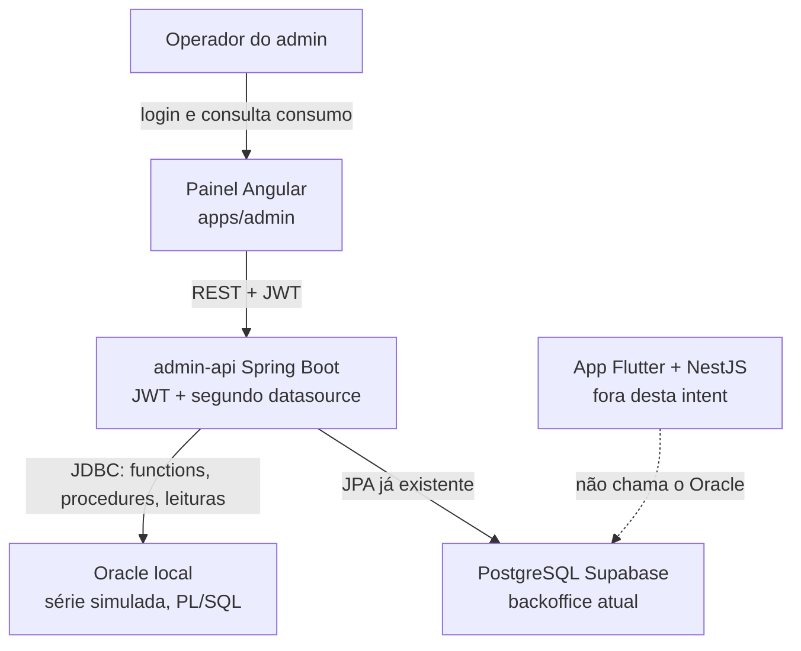

# Persistência Oracle e consumo da IA — System Context

## System Overview

Camada nova no backoffice do Conecta Geração. O operador vê, no painel Angular, o consumo simulado da IA em tokens. O `admin-api` (Spring Boot) fala com um Oracle instalado na máquina por JDBC e continua falando com o PostgreSQL (Supabase) para conteúdos, dicas, campanhas e o dashboard atual.

O app Flutter e o NestJS não entram neste fluxo. A série de consumo nasce no Oracle e permanece lá.

## Context Diagram

## Actors

- **Operador** (Human): Única pessoa que usa a tela. Já autentica com o JWT do `admin-api`.
- **admin-api** (System): Spring Boot. Mantém o datasource Postgres e ganha um datasource Oracle. Expõe a consulta de consumo e o disparo da procedure.
- **Oracle local** (External): Instância instalada na máquina. Guarda usuários simulados, leituras de tokens, alertas e o PL/SQL.
- **PostgreSQL / Supabase** (External, legado): Continua sendo o banco do produto e do backoffice atual. Esta intent não grava consumo nele.
- **App Flutter e NestJS** (Legacy): Fora da fronteira. Não recebem chamada desta tela e não passam a usar Oracle.

## External Integrations

| Sistema | Direção | Dados | Protocolo | Risco |
|---------|---------|-------|-----------|-------|
| Oracle local | admin-api → Oracle | Usuários simulados, leituras, alertas, chamadas PL/SQL | JDBC | Alto se a instância estiver desligada ou a URL/credencial estiver errada |
| PostgreSQL Supabase | admin-api ↔ Postgres | Conteúdos, dicas, campanhas, login do operador | JDBC/JPA já existente | Baixo — não muda o schema |
| Painel Angular | Angular → admin-api | JWT, consulta de consumo, disparo da rotina | REST JSON | Baixo |

## Data Flows

### Inbound

| Origem | Dados | Validação |
|--------|-------|-----------|
| Operador, via Angular | JWT no header, período e usuário da consulta, ação de disparar o alerta | JWT de operador obrigatório. Período com início anterior ao fim. Usuário existente no Oracle |
| Scripts SQL | DDL, functions, procedures e seed simulado | Aplicados na instância local, sem dados reais do Supabase |

### Outbound

| Destino | Dados | Garantia |
|---------|-------|----------|
| Angular | Indicador numérico de tokens, texto formatado, lista de alertas, relatório por usuário | JSON do `admin-api`. Erro claro se o Oracle não responder |
| Oracle | Alerta gravado pela procedure quando o total do período atinge 10.000 tokens | Um alerta por usuário e período. Segunda execução não duplica |

## High-Level Constraints

- Oracle instalado na máquina, sem Docker.
- Credenciais só por variável de ambiente.
- Segundo datasource. O acesso ao Postgres não muda de alvo.
- Limite padrão de consumo alto: 10.000 tokens no período.
- Nenhum dado de produção do Supabase é copiado para o Oracle.

## Key NFR Goals

- A tela autenticada mostra os quatro blocos em menos de 3 s com o seed local.
- Oracle indisponível não derruba os endpoints atuais do Postgres.
- Functions e procedures tratam exceção e não gravam alerta parcial.
